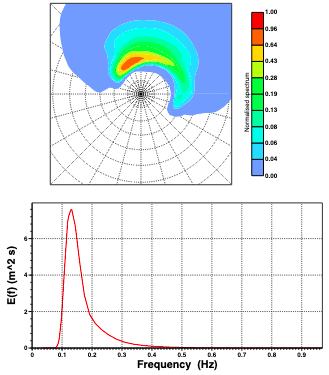
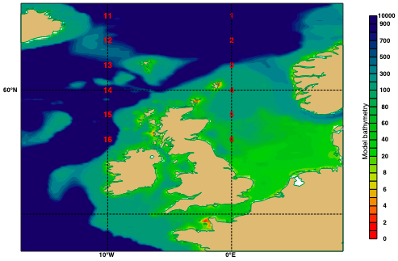

# OceanSpec
Visualize the ocean wave spectra in a meaningful way. 

## ECMWF convention

Following the IFS Documentation - Cy43r1, the two-dimensional (2-D) wave spectrum F (f, θ) is computed at each grid point of the wave model. In its continuous form, F (f, θ) describes how the wave energy is distributed as function of frequency f and propagation direction θ. In the numerical implementation of the wave model, F is discretised using nf frequencies and nθ directions. In the current analysis and deterministic forecast configuration nf = 36 and nθ = 36 (in ERA5, nf = 30 and nθ = 24). Whenever possible, F (f, θ) is output and archived as parameter 251. It corresponds to the full description of the wave field at any grid point. It is however a very cumbersome quantity to plot as a full field since it consists of nf × nθ values at each grid point. Nevertheless, it can plotted for specific locations. 

Shown below is the spectrum at Location 6 as indicated on the map (model bathymetry, parameter 219 is also shown). The 2-D wave spectrum is represented using a polar plot representation, where the radial coordinate represents frequency and the polar direction is the propagation direction of each wave component. The oceanographic convention is used, such that upwards indicates that waves are propagating to the North. The frequency spectrum, which indicates how wave energy is distributed in frequency, is obtained by integrating over all directions. Typically, the sea state is composed of many different wave systems.

 
> Normalised 2D spectrum and frequency spectrum for Location 6 (56°N, 0°E) at 20160327 06:00. Hs = 3.09 m, Tm = 6.68 s, Tp = 7.63 s, MWD = 358°, PWD = 330°, Peakedness Qp = 1.34, Directional Spread = 0.57. Concentric circles are every 0.05 Hz. Map showing Location 6 and other locations with wave spectra available.

Therefore, a good way to visualize these wave spectra on cartographic maps is needed.

## Requirement

Based on the data downloaded from ECMWF, display the wave height field and allow users click on the map. Snap the cursor location to a data point on the grid, extract data and draw a polar plot showing the ocean wave spectrum. 

When the user moves the cursor and clicks elsewhere, update the spectrum plot.

## Implementation

* Using `Matplotlib` for plotting a color field of global wave height
* Using `magpye`, `cartopy`, or `Basemap` to create geographical grid and plot coastlines
* Using `Matplotlib` for plotting spectral graphs.

## Credit

This work is done in ECMWF Hackathon, Reading 11-12 June 2022.

Nguyen Q. Chien writes the code run on Anaconda Python with Matplotlib/Basemap/Cartopy visualization.

James Varndell writes the  and helped Nguyen Chien use the libraries delivered by ECMWF.

 

