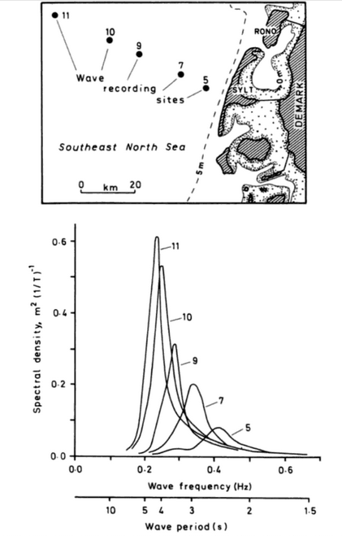
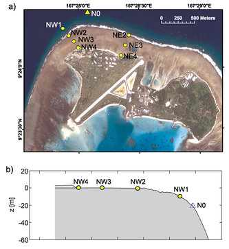
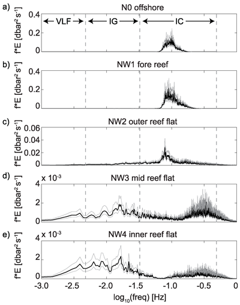
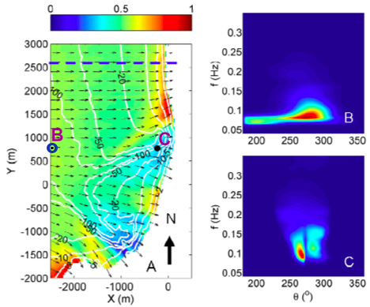
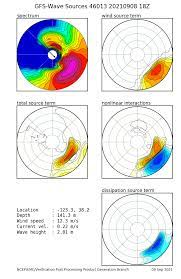

# Background information

## Wave spectrum 

Spectral representation is key to describe the irregular ocean surface level. Information including random wave amplitudes whereas the random phase is omitted. The wave energy density is described as a function of frequency, E(f).

The use of radar satellite for measuring sea surface height allows us to reconstruct the frequency-directional spectrum, E(f,θ). ECMWF has such data (more on that later).

Despite the randomnese of individual waves, the wave spectra usually exhibit typical shapes, namely Pierson-Moskowitz spectrum for fully-developed seas and Jonswap spectrum for young seas. 

The formulation involves α is an energy scaling coefficient, σp is the peak radial frequency, γ0 is the peak enhancement factor and ε determines the spectral width around the peak. 

* PM spectrum, α = 0.0081 and γ0 = 1. 
* Jonswap spectrum γ0 = 3.3, and either ε = 0.07 for σ < σp or ε = 0.09 for σ > σp.

Regarding the directional distribution of wave energy density, a symmetric treatment is frequently used, for example the cos^m distribution, D(θ) = A cos(θ - θp)^m.

where A is a proportionality factor to ensure unity of the integrated directional distribution function and θp is the peak direction. Small (large) values of m correspond to broad (narrow) directional distribution. The frequency-directional spectrum can now be constructed according to:

E(f,θ) = E(f) D(θ)

An example case (energy density distribution of a random sea state according to a Jonswap frequency spectrum and cosm directional distribution with m = 20 with a peak frequency of 0.1 Hz and a peak direction of 0°.)

## ECMWF data products

ECMWF has data for deriving wave spectrum. The SAR data is collected from ERS-1, ERS-2, and more recently, ENVISAT. SAR data assimilation has been made using a spectral partitioning scheme, based on the principle of the inverted catchment area. The analysed spectra are reconstructed by resizing and reshaping the model spectra based on the mean parameters obtained from the optimum interpolation scheme.

## Example of wave spectra visualization

The earlier researches, wave spectra are usually shown as E(f), showing a change of spectrum shape in a coastal transect (being natural or in a laboratory).

> Wave spectra observed offshore Sylt (Carter 1988)

 

> Wave spectra at selected locations along a coastal transect of a coral reef ()

With researches employing a 2-D spectral wave model, the full information of wave spectrum is available at any location in the domain, and users can pick specific points to view the spectrum of interest.

> Computed wave spectra offshore and nearshore Scripps, La Jolla CA (Roelvink & Reniers 2011).

For example, with the simulation using SWAN model for the west waves approaching Scripps (La Jolla, CA) the offshore spectrum has a strong swell peak around θ = 270° and a much weaker peak incident from the South-West around θ = 200° (panel B). When approaching the shoreline, wave refraction (as evidence from panel A) causes energy to shift away from the main direction resulting in a bi-modal directional spectrum (panel C) (Roelvink & Reniers 2011). Also, refraction is stronger for lower frequencies, E(f,θ) is no longer symmetric around θ = 270°.

The representation of wave spectra on map is usually done with a radial chart.

> Radial charts of wave spectra, NCEP data

## Data reduction

Instead of representing the whole spectra, in ECMWF products, the integral parameters are computed. Two regimes are defined:

* wind sea, if 1.2 × 28(u∗/c) cos(θ − φ) > 1 
* swell, if 1.2 × 28(u∗/c) cos(θ − φ) ≤ 1 

Swell partitions: first, second, and third corresponding to the three most energetic systems. The method has been adapted and optimized from that of Hanson and Phillips (2001). Swell wave integrated parameters are calculated for these three partitions; however they are not enough to reconstruct the exact the 2-D spectrum. 